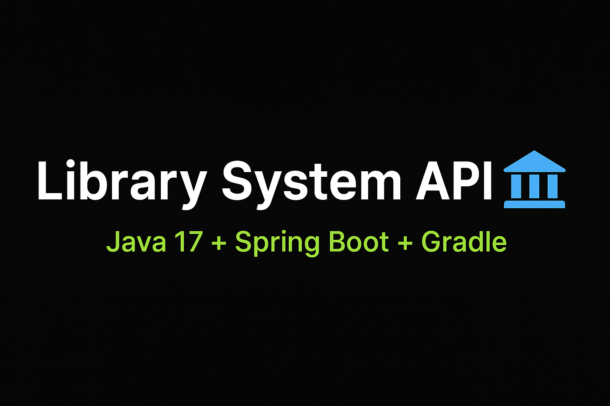

<p align="center">
  
</p>

# 📚 Library System API

API REST desenvolvida em **Java 17** com **Spring Boot** para gerenciamento de bibliotecas.  
O sistema permite realizar operações de CRUD (Create, Read, Update, Delete) em:  
📍 **Endereços** | ✍️ **Autores** | 📖 **Livros** | 🏛 **Bibliotecas**

---

## 🚀 Tecnologias utilizadas
- ☕ Java 17
- 🌱 Spring Boot
- 📦 Gradle
- 🗄️ Spring Data JPA
- 🐬 MySQL (ou H2 para testes)

---

## ⚙️ Funcionalidades
✔️ Cadastrar, listar, atualizar e remover **endereços**  
✔️ Cadastrar, listar, atualizar e remover **autores**  
✔️ Cadastrar, listar, atualizar e remover **livros**  
✔️ Cadastrar, listar, atualizar e remover **bibliotecas**

---

## 🏗 Estrutura do projeto
```
src/
 └── main/
      ├── java/com/bevilhonda/library
      │     ├── controller/   -> Endpoints REST
      │     ├── model/        -> Entidades JPA
      │     ├── repository/   -> Persistência de dados
      │     └── service/      -> Lógica de negócio
      └── resources/
            ├── application.properties
            └── data.sql (opcional para carga inicial)
```

---

## ▶️ Como executar

### Pré-requisitos
- ☕ Java 17
- 📦 Gradle
- 🗄 Banco configurado (MySQL ou H2)

### Passos
```bash
# Clone o repositório
git clone https://github.com/Bevilhonda/Library-System.git

# Entre no diretório
cd Library-System

# Execute a aplicação
./gradlew bootRun
```

A aplicação estará disponível em:  
👉 `http://localhost:8080`

---

## 🌍 Endpoints principais (exemplos)

### Autores
- `GET /autores` → Lista todos os autores  
- `POST /autores` → Cria um novo autor  
- `PUT /autores/{id}` → Atualiza autor existente  
- `DELETE /autores/{id}` → Remove um autor  

### Livros
- `GET /livros` → Lista todos os livros  
- `POST /livros` → Cria um novo livro  
- `PUT /livros/{id}` → Atualiza um livro existente  
- `DELETE /livros/{id}` → Remove um livro  

*(endereços e bibliotecas seguem o mesmo padrão)*

---

## 👨‍💻 Autor
Desenvolvido por **Marcelo Bevilacqua de Andrade** 🚀  
🔗 [Meu GitHub](https://github.com/Bevilhonda)

---

## 📜 Licença
Este projeto está sob a licença **MIT** – consulte o arquivo [LICENSE](LICENSE).
